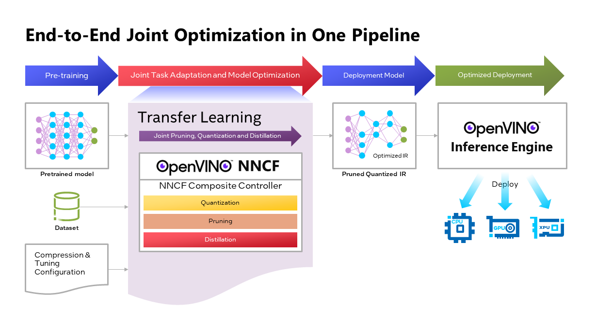

# Intel's JPQD BERT MLPerf v3.0 Submission

## Joint Pruning, Quantization & Distillation (JPQD)
<p align="center">

</p>

JPQD is a single optimization pipeline for improving transformer inference performance by pruning, quantization and distillation in parallel during transfer learning of a pretrained transformer. JPQD is powered by [OpenVINO suite of tools](https://docs.openvino.ai/latest/home.html) and integrated in [Optimum-Intel](https://github.com/huggingface/optimum-intel), an extension of Hugging Face's transformers for optimization tools for efficient deployment on Intel platforms. JPQD alleviates the complexity of sequential compression by transforming a pretrained transformer with [quantization](https://github.com/openvinotoolkit/nncf/blob/develop/docs/compression_algorithms/Quantization.md#uniform-quantization-with-fine-tuning) and [pruning](https://github.com/openvinotoolkit/nncf/blob/develop/nncf/experimental/torch/sparsity/movement/MovementSparsity.md) operators at the beginning of the flow using [OpenVINO NNCF](https://github.com/openvinotoolkit/nncf), then fine-tunes for target task with distillation from a larger task-tuned teacher. The output of JPQD is a structurally-pruned, quantized model in OpenVINO IR which is ready to deploy with [OpenVINO runtimes](https://docs.openvino.ai/latest/openvino_docs_OV_UG_supported_plugins_Supported_Devices.html) optimized for a range of Intel devices. JPQD is also tunable in compression magnitude, allowing accuracy-efficiency trade-off depending on use cases.

In this submission, we applied JPQD on 3 pretrained BERT models, **BERT-large**, **BERT-base**, and **MobileBERT** tuned for SQuADv1.1, presenting 4 optimized models for MLPerf Inference v3.0 benchmarks:
* **BERT-large-99.9** and **99**: We dialed JPQD pruning intensity to target 99.9% and 99% of [MLPerf FP32 BERT SQuAD F1 accuracy](https://zenodo.org/record/3733896). As a result, two models of different rates of structured sparsity showed flexibility in accuracy-efficiency trade-off.
* **BERT-base-99**: JPQD was configured to optimize BERT-base to meet 99% of F1 baseline. We showed that the optimized model not only improved significantly in efficiency but also outperformed [vanilla BERT-base/SQuAD F1](https://arxiv.org/pdf/1810.04805.pdf) which was mainly attributed to distillation from a large teacher.
* **MobileBERT-99**: We initialized pretrained MobileBERT with 15 transformer blocks and subsequently putting it through JPQD to attain 99% of MLPerf F1 baseline.

More details on reproducing the models can be found in the [calibration README](./../../../calibration/bert-99.9_jpqd-large/openvino-cpu/README.md).

## Benchmarks

| Model Name              | F1 [%] | Relative to<br>[Pytorch](https://zenodo.org/record/3733896)<br>[FP32 F1](https://zenodo.org/record/3733896) | Structured<br>Sparsity<br>[%] | Server Mode<br>Throughput<br>[samples/sec] | Server Mode<br>Improvement | Offline Mode<br>Throughput<br>[samples/sec] | Offline Mode<br>improvement |
|:------------------------|:------:|:-------------------------:|:--------------------------:|-----------------------------------:|:--------------------------:|-------------------------------------:|:---------------------------:|
| Reference IR            | 90.231 | 0.993 |  dense |    99.93 |  1.0X |  186.09 | 1.0X |
| bert-99.9_jpqd-large    | 90.945 | 1.001 |   77.7 |   549.86 |  5.5X |  768.60 | 4.1X |
| bert-99_jpqd-large      | 90.154 | 0.992 |   82.0 |   734.13 |  7.3X |  865.76 | 4.7X |
| bert-99_jpqd-base       | 90.141 | 0.992 |   52.2 |  1023.37 | 10.2X | 1105.24 | 5.9X |
| bert-99_jpqd-mobilebert | 90.293 | 0.994 |   34.5 |  1662.61 | 16.6X | 1678.28 | 9.0X |

Notes:
1. Reference IR was obtained by converting [MLPerf reference Int8 BERT-Large ONNX model](https://zenodo.org/record/3750364) to OpenVINO IR using [OpenVINO's Model Optimizer](https://docs.openvino.ai/latest/openvino_docs_MO_DG_Deep_Learning_Model_Optimizer_DevGuide.html)
2. All models above were quantized. Structured sparsity was denominated by linear layers in transformer block (self-attention and feed forward networks).
3. The benchmark was evaluated using a server with two Intel(R) Xeon(R) Platinum 8480+ (Sapphire Rapids) CPUs with 56 cores, CPU runtime of [OpenVINO 2022.3](https://pypi.org/project/openvino/2022.3.0/), with input to the model always a sequence of length 384.

## JPQD Models
JPQD models are provided in [code/bert-99.9_jpqd-large/openvino-cpu/models/](./models/). These models were split into 50MB files if full model file is > 50MB.


## Setup from Source
1. Navigate to [code/bert-99.9_jpqd-large/openvino-cpu](./) directory.
 <!-- This directory is your BUILD_DIRECTORY. -->
1. Use Python 3.9+ to setup environment. You may need to install `python3-venv` for your version of Python3.
	```bash
	python3.9 -m venv .venv
    source .venv/bin/activate
    ./build-mlperf.sh
	```
1. This benchmark uses the [SQuAD v1.1](https://rajpurkar.github.io/SQuAD-explorer/explore/1.1/dev/) validation dataset. Download the dataset:
	```bash
	./download_squadv1.1.sh squad
    export BERT_DATA_DIR=${PWD}/squad
	```
1. Prepare JPQD models and set environment variable:
    ```bash
    ./prepare_models.sh
    export BERT_MODEL_DIR=${PWD}/models
    ```
1. Run the performance script: ```./performance.sh```


## Setup with docker
1. Navigate to [code/bert-99.9_jpqd-large/openvino-cpu](./) directory.
1. Download SQuAD v1.1 dataset:
	```bash
	./download_squadv1.1.sh squad
	```
1. Prepare JPQD models:  ```./prepare_models.sh```
1. Navigate to [code](./../../) directory.
1. Build docker: ```bash build_workflow_containers.sh bert-99.9_jpqd-large```
1. Navigate to [code/bert-99.9_jpqd-large/openvino-cpu](./) directory.
1. Run the performance script: ```./performance.sh```
1. Run docker:
    ```bash
    docker run --name intel_bert_open --privileged -it --net=host --ipc=host \
    -v ${PWD}/models:/opt/workdir/models/bert \
    -v ${PWD}/squad:/opt/workdir/datasets/squad \
    mlperf_inference_datacenter_bert_open:3.0 bash
    ```
<br>


## Run Benchmarks

### Performance
Scripts to run the **Performance** benchmarks are in [code/bert-99.9_jpqd-large/openvino-cpu](./). The syntax to run the benchmark:
```
./run_<scenario>.sh <model_name>
```

For instance, to run Offline Performance benchmark for BERT-large-99.9 JPQD model:
```
./run_offline.sh bert-99.9_jpqd-large
```

### Accuracy
Scripts to run the **Accuracy** benchmarks are also in [code/bert-99.9_jpqd-large/openvino-cpu](./).
The provided scripts:
+ First runs the benchmark in ```Accuracy``` mode to generate ```mlperf_log_accuracy.json```
+ Runs a dedicated accuracy tool provided by MLPerf

The syntax to perform Accuracy benchmark:

```
./run_<scenario>_acc.sh <model_name>
```

For instance, to run Offline Accuracy benchmark for MobileBERT JPQD model:

```
./run_offline_acc.sh bert-99_jpqd-mobilebert
```
<br>

