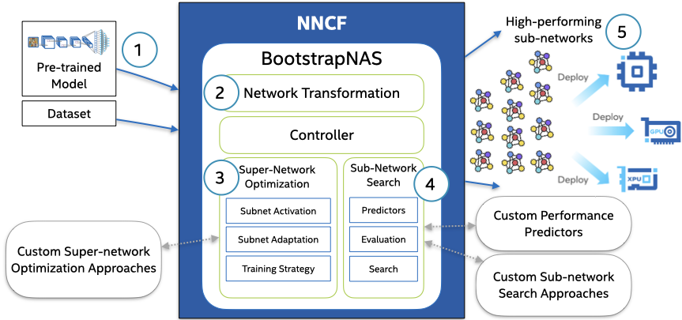

# Intel's BootstrapNAS RetinaNet MLPerf v3.0 Submission

## BootstrapNAS
BootstrapNAS is a modular, multi-stage software AI automation capability that takes as input a pre-trained DL model, automatically generates a super-network, and performs a Neural Architecture Search (NAS), producing as result, a set of efficient ready-to-deploy models that outperform the original model in terms of either accuracy, performance, or both objectives for the underlying target hardware platform. This capability is available in the [Neural Network Compression Framework (NNCF)](https://github.com/openvinotoolkit/nncf/tree/develop/nncf/experimental/torch/nas/bootstrapNAS).

<p align="center">

</p>

```BibTex
@article{DBLP:journals/corr/abs-2112-10878,
  author    = {J. Pablo Muñoz and Nikolay Lyalyushkin and Yash Akhauri and Anastasia Senina and
               Alexander Kozlov and Nilesh Jain},
  title     = {Enabling NAS with Automated Super-Network Generation},
  journal   = {CoRR},
  volume    = {abs/2112.10878},
  year      = {2021},
  url       = {https://arxiv.org/abs/2112.10878},
  eprinttype = {arXiv},
  eprint    = {2112.10878},
  timestamp = {Tue, 04 Jan 2022 15:59:27 +0100},
  biburl    = {https://dblp.org/rec/journals/corr/abs-2112-10878.bib},
  bibsource = {dblp computer science bibliography, https://dblp.org}
}
```
<br>


## RetinaNet Benchmarks

BootstrapNAS provides up to 1.64x boost in comparison to our [MLPerf v3.0 Closed RetinaNet Submission](../../../../../../closed/Intel/code/retinanet/pytorch-cpu).
The benchmark was evaluated using a server with two Intel(R) Xeon(R) Platinum 8480+ (Sapphire Rappids) CPUs with 56 cores.

| Benchmark | mAP [%] | % of FP32 mAP | Server Throughput [samples/sec]  |  Offline Throughput [samples/sec]  |
|:---------|:-------:|:-------------:|:--------------------------------:|:----------------------------------:|
| [Intel MLPerf v3.0 Closed RetinaNet Submission](../../../../../../closed/Intel/code/retinanet/pytorch-cpu) | 37.36 | 99.49 | 213.86 | 288.228 |
| BootstrapNAS | 37.79 | 100.64 | 349.76 | 438.112 |
<br>


## Setup Instructions
+ To run with docker, navigate to **Setup with docker image** (after downloading dataset and generating/calibrating int8 model)
<br>


### Setup Conda Environment and Build Dependencies
+ Download and install Anaconda3
  ```bash
  wget https://repo.anaconda.com/archive/Anaconda3-2022.05-Linux-x86_64.sh
  bash Anaconda3-2022.05-Linux-x86_64.sh
  export CONDA_BASE_DIR=${HOME}/anaconda3
  export PATH=${PATH}:${CONDA_BASE_DIR}/bin
  ```
  Here we assume, Anaconda is installed in `${HOME}` directory.  If this is not true, please update `${CONDA_BASE_DIR}` accordingly.

+ Setup conda environment to install requirements, and build the src code.
  ```bash
  CUR_DIR=$(pwd)
  git clone <path/to/this/repo>
  cd <path/to/this/repo>/open/Intel/code/retinanet/pytorch-cpu
  export USE_CUDA=0
  bash prepare_env.sh
  conda activate retinanet-env-open
  ```

+ Build Benchmark
  ```bash
  bash build_binaries.sh
  ```
<br>

### Download the dataset

+ Setup env vars
  ```bash
  CUR_DIR=$(pwd)
  export WORKLOAD_DATA=${CUR_DIR}/data
  mkdir -p ${WORKLOAD_DATA}

  export ENV_DEPS_DIR=${CUR_DIR}/retinanet-env-open
  ```

+ Download OpenImages (264) dataset
  ```bash
  bash openimages_mlperf.sh --dataset-path ${WORKLOAD_DATA}/openimages
  ```
  Images are downloaded to `${WORKLOAD_DATA}/openimages`

+ Download Calibration images
  ```bash
  bash openimages_calibration_mlperf.sh --dataset-path ${WORKLOAD_DATA}/openimages-calibration
  ```
  Calibration dataset downloaded to `${WORKLOAD_DATA}/openimages-calibration`
<br>


### Calibrate and generate torchscript model

Run Calibration
```bash
cp /path/to/fx_qat.pth ${WORKLOAD_DATA}/
export CALIBRATION_DATA_DIR=${WORKLOAD_DATA}/openimages-calibration/train/data
export MODEL_CHECKPOINT=${WORKLOAD_DATA}/fx_qat.pth
export CALIBRATION_ANNOTATIONS=${WORKLOAD_DATA}/openimages-calibration/annotations/openimages-mlperf-calibration.json
bash run_calibration.sh
```
* Generated model is located in ${WORKLOAD_DATA}.  We have also provided in [./model](./model/).  To use provided model, run:
  ```bash
  cp ./model/retinanet-BNAS-int8-model.pth ${WORKLOAD_DATA}/
  ```
<br>


### Setup with docker image

You can skip the steps of **Setup Conda Environment and Build Dependencies**. Follow the data and model prepations steps above. Use the following steps to use docker image:

1. Navigate to [code](./../../) directory.
1. Build docker: ```bash build_workflow_containers.sh retinanet```
1. Navigate to [code/retinanet/pytorch-cpu](./) directory.
1. Run docker:
    ```bash
    docker run --name intel_retinanet_ipex --privileged -it --net=host --ipc=host \
    -v ${WORKLOAD_DATA}:/opt/workdir/code/retinanet/pytorch-cpu/data \
    mlperf_inference_datacenter_retinanet_ipex_open:3.0 bash

    export http_proxy=<your/proxy>
    export https_proxy=<your/proxy>
    ```


## Run Benchmarks
+ Setup exports for environment
```bash
source setup_env.sh
```

### Performance
Scripts to run the **Performance** benchmarks are in [code/retinanet/pytorch-cpu](./). The syntax to run the benchmark:
+ Offline
  ```bash
  ./run_offline.sh
  ```

+ Server
  ```bash
  ./run_server.sh
  ```

### Accuracy
Scripts to run the **Accuracy** benchmarks are also in [code/retinanet/pytorch-cpu](./).
The provided scripts:
+ First runs the benchmark in ```Accuracy``` mode to generate ```mlperf_log_accuracy.json```
+ Runs a dedicated accuracy tool provided by MLPerf

The syntax to perform Accuracy benchmark:
+ Offline
  ```bash
  ./run_offline_accuracy.sh
  ```

+ Server
  ```bash
  ./run_server_accuracy.sh
  ```
